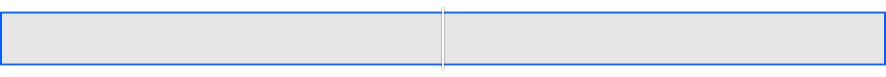
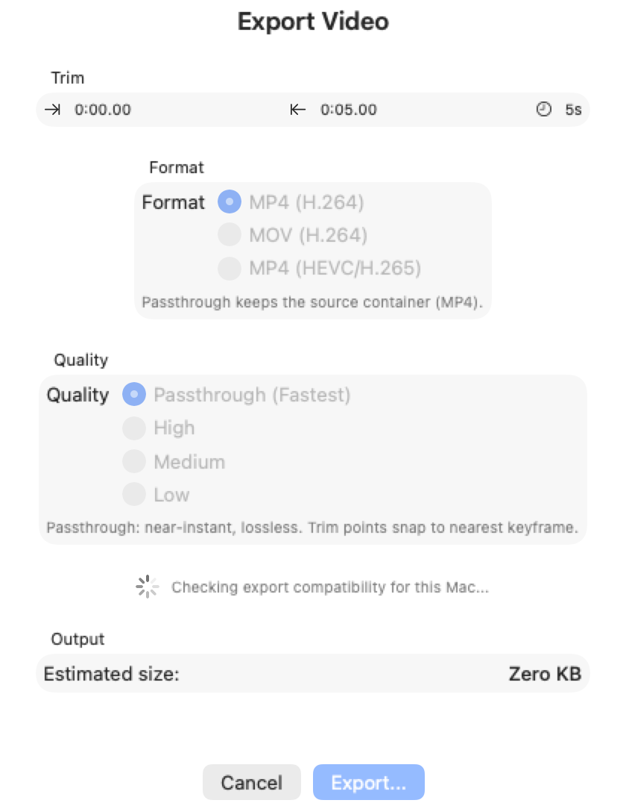
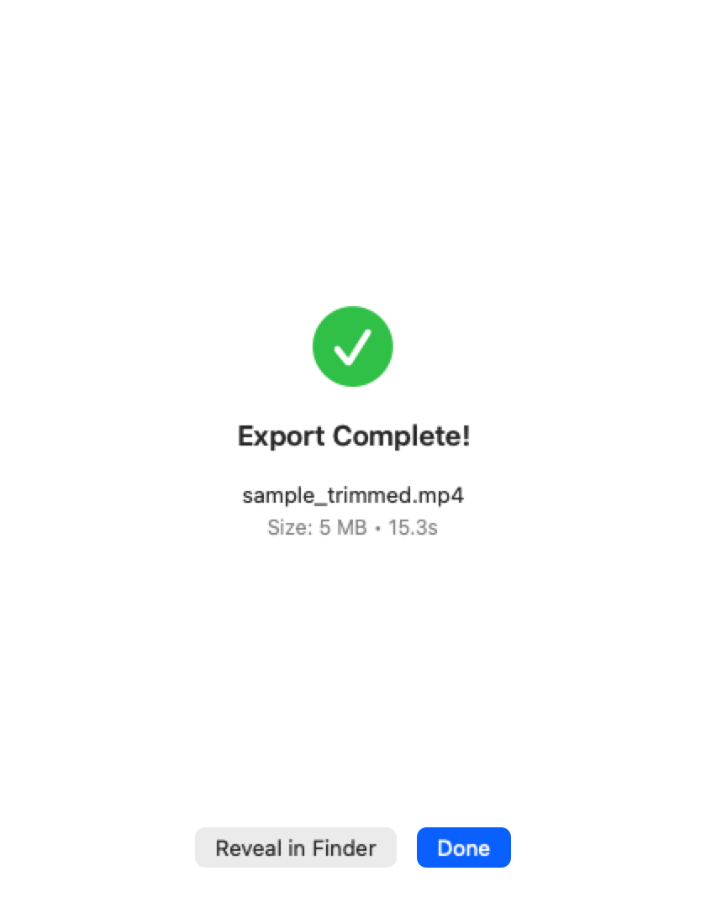

# Design Screenshots

Run `make screenshots` to refresh these images from the current snapshot suite.

## Player Controls (Paused)

## Player Controls (Playing)

## Timeline (No Thumbnails)

## Timeline (Trim At Start)

## Timeline (Full Range)

## Export Sheet (Initial State)

## Export Completion View

